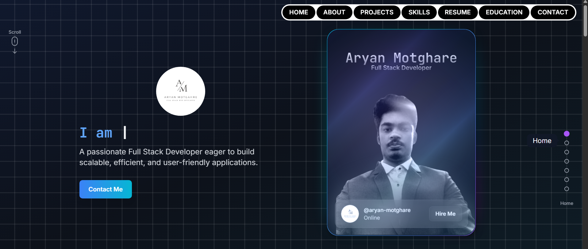

# 🌐 Personal Portfolio Website

A **full-stack personal portfolio website** built with **React.js (frontend)** and **Node.js + Express + MongoDB (backend)**. It showcases my skills, education, projects, and includes a **contact form** that stores messages in a MongoDB database.

---

## 🚀 Features
- Responsive modern UI with React.js
- Sections: Home, About, Education, Projects, Contact
- Contact form integrated with MongoDB (saves user messages)
- Node.js & Express REST API for backend communication
- Deployed frontend + backend

---

## 🛠️ Tech Stack

### Frontend
- React.js
- React Router
- TailwindCSS / CSS Modules
- Fetch API for backend communication

### Backend
- Node.js
- Express.js
- MongoDB with Mongoose
- CORS & dotenv for configuration

---

## 📂 Project Structure
```
portfolio/
│── backend/            # Node.js + Express backend
│   ├── models/         # Mongoose models (Contacts)
│   ├── routes/         # API routes
│   ├── server.js       # Entry point for backend
│
│── frontend/           # React frontend
│   ├── src/
│   │   ├── pages/      # Pages (Home, Contact, etc.)
│   │   ├── components/ # Reusable components
│   │   ├── App.js      # Main React app
│   │   └── index.js    # Entry point
│
└── README.md
```

---

## ⚡ Setup Instructions

### 1️⃣ Clone the Repository
```bash
git clone https://github.com/aryangithub02/portfolio.git
cd portfolio
```

### 2️⃣ Setup Backend
```bash
cd backend
npm install

# Create a .env file
MONGO_URI=your_mongodb_connection_string
PORT=3001

npm start
```

### 3️⃣ Setup Frontend
```bash
cd frontend
npm install
npm start
```

### 4️⃣ Open in Browser
```
http://localhost:5000
```

---

## 📬 API Endpoint
- **POST /api/contact** → Saves contact form data (name, email, message) to MongoDB.

Example:
```json
{
  "name": "Aryan Motghare",
  "email": "aryanmotghare92@gmail.com",
  "message": "Hello, this is a test message!"
}
```

---

## 📸 Screenshots
_Add screenshots of your portfolio UI here_


---

## 📤 Deployment
- Frontend: Vercel / Netlify
- Backend: Render / Railway / Heroku
- Database: MongoDB Atlas

---

## 👨‍💻 Author
- **Aryan Motghare**
- [LinkedIn](https://linkedin.com/in/aryan-motghare)
- [GitHub](https://github.com/aryangithub02)
- [Portfolio](https://aryanmotghareresume.netlify.app/)

---

✨ Thank you for checking out my portfolio!